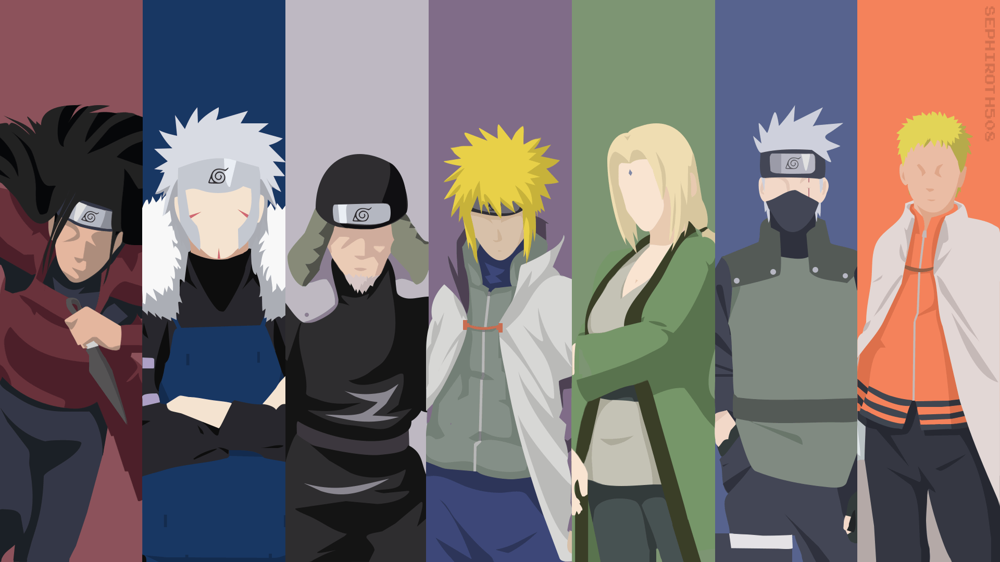

# Hokage's Path

Hokage's Path is just a playful method to encourage me to study more, feel free to use or modify for your interests.
In my case, I really like [Naruto](https://pt.wikipedia.org/wiki/Naruto) (anime) and its awesome world.

If you know Naruto, may you already know what I'm talking about here!

_PS: I'll not accept any PR, because this is my own opinion/preference_

## What is Hokage's Path?

Hokage is the ultimate position we can achieve in Naruto's world, it's like a president/mayor. They are considered the most powerful ninja in their villages!

Here, instead of just power, I'll aim to have strong/powerful __knowledge__!
My goal here is to achieve the Hokage position in my studies, having a powerful knowledge about stuff I want to!

## Explanation

I really like to discover and learn new things, especially software engineering stuff,
but sometimes I simply forget to do it or just I don't feel motivated,
I think creating this abstraction from Naruto's world can engage me more.

So I'm going to cover how my study path is, from now on you're a Ninja from Naruto's world!

Ok, let me explain how it works!

## Missions

A mission represents some task I have to do (e.g. Study about Monads, Learn a bit of Elixir, Watch a lecture).

Ninjas can take as many missions as they can. But every mission should have some information before we start.

Required information:
* __Descriptive name__: You have to know what you'll do or what you're doing without having to open the mission parchment
* __Good description__:
* __Mission Level__: Learn about [here](#mission-rank)
* __Mission Importance__: Learn about [here](#mission-importance)

### Mission Rank

Unlike in Naruto, here a mission rank represents the time to be completed. The ranks are:

* Rank S: Take too much time to complete, more than seven days to complete (e.g. complete a long course/training)
* Rank A: From four to seven days to complete
* Rank B: From two to four days to complete
* Rank C: From one to two days to complete
* Rank D: It's quickly to complete (e.g. read an article), less than one day to complete

### Mission Importance

> TODO: Make a better definition to the imporatences

The mission importance is the complexity level:

* Hokage: The Hokage has powerful knowleged this level needs a lot of previous knowledge to get done
* Jounin
* Chuunin
* Genin: 
* Ninja Academy Student (NAS): No previous knowledge required

## Organization

I'm going to use [GitHub Project Board](https://docs.github.com/en/github/managing-your-work-on-github/about-project-boards) to organize my tasks/missions.

## Results

To certify that I made something, every completed mission needs a report
telling about what I learned, watched, read, the results I got.

Basically, summarizing all of the content!

> TODO: Define a way to store those reports
